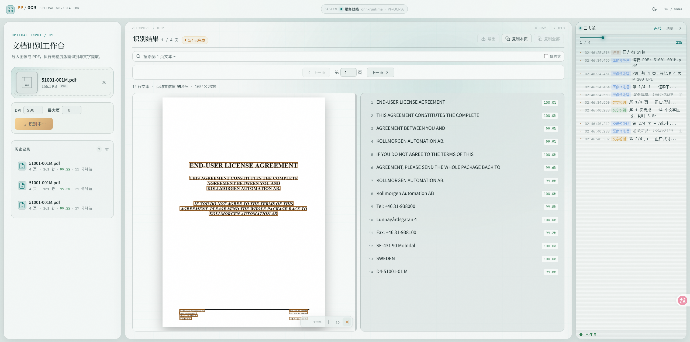

# OCR-Kit

基于 **PP-OCRv6、ONNX Runtime、FastAPI 与 Vue 3** 构建的现代 OCR 工作台。支持图片和 PDF 文档识别、逐页结果展示、检测框与文本联动、实时进度日志以及结果导出。

## 界面预览



## 功能特性

- 图片 OCR：支持 JPG、PNG、WebP、BMP、TIFF 等常见格式
- PDF OCR：按页渲染并逐页识别，可配置 DPI 和最大处理页数
- 坐标框联动：悬停或点击识别框，同步定位右侧文字
- PDF 分页联动：PDF 页面、检测框和识别结果同步切换
- 流式进度：通过 Server-Sent Events 实时显示日志和分页结果
- 结果检索：支持当前页文字搜索和低置信度筛选
- 结果导出：复制单行、当前页、全部内容或导出 TXT
- 识别历史：在浏览器本地保存近期识别结果
- 模型切换：一键切换 PP-OCRv6 Tiny / Small / Medium，兼顾速度与精度
- 硬件适配：检测 CPU、内存、显卡与 ONNX Runtime 执行提供程序
- 桌面设置：可修改模型目录、项目目录、CPU 线程数、默认模型和推理设备
- Windows 安装：提供 PyInstaller + Inno Setup 构建链和安装时配置引导
- 明暗主题：工业扫描工作台风格，支持深色和浅色模式
- 跨平台：支持 Windows PowerShell、Linux 和 WSL

## 技术栈

### 后端

- Python 3.11 / 3.12
- FastAPI
- PaddleOCR 3
- PP-OCRv6
- ONNX Runtime
- PyMuPDF
- Pillow
- NumPy

### 前端

- Vue 3
- Vite
- PDF.js
- 原生 SSE
- Canvas 与 SVG OCR 覆盖层

## 系统架构

```text
┌──────────────────── Vue 3 Frontend ────────────────────┐
│ 文件上传 │ PDF.js 页面渲染 │ OCR 框联动 │ 日志与结果流 │
└───────────────────────┬────────────────────────────────┘
                        │ HTTP / SSE
┌───────────────────────▼────────────────────────────────┐
│                    FastAPI Server                       │
│ 图片预处理 │ PDF 页面渲染 │ 任务调度 │ 流式事件广播    │
└───────────────────────┬────────────────────────────────┘
                        │
┌───────────────────────▼────────────────────────────────┐
│             PP-OCRv6 + ONNX Runtime                     │
│               文字检测与文字识别                        │
└────────────────────────────────────────────────────────┘
```

## 项目结构

```text
OCR-Kit/
├── app_config.py             # 持久化配置、硬件检测和性能建议
├── launcher.py               # Windows 桌面版启动器
├── server.py                 # FastAPI OCR 服务及前端静态托管
├── requirements.txt          # Python 运行依赖
├── download_models.py        # 可选模型下载脚本
├── test_ocr.py               # 命令行 OCR 测试
├── packaging/
│   ├── build.ps1             # CPU/CUDA 发行版构建脚本
│   ├── OCR-Kit.iss           # Inno Setup 安装器定义
│   └── hardware_probe.ps1    # 安装阶段硬件探测
└── frontend/
    ├── src/
    │   ├── api/              # HTTP 与 SSE 客户端
    │   ├── components/       # 上传、结果、日志和历史组件
    │   ├── composables/      # OCR 与历史状态管理
    │   └── assets/           # 全局视觉样式
    ├── public/               # 图标等静态资源
    ├── package.json
    └── vite.config.js
```

## 快速开始

### 1. 克隆项目

```bash
git clone https://github.com/chun-hua/OCR-Kit.git
cd OCR-Kit
```

### 2. 创建 Python 环境

推荐使用 Python 3.11 或 Python 3.12，并使用独立环境安装依赖。

#### Windows PowerShell

```powershell
py -3.11 -m venv venv-win
.\venv-win\Scripts\Activate.ps1
python -m pip install --upgrade pip
python -m pip install -r requirements.txt
```

如果 PowerShell 禁止执行激活脚本：

```powershell
Set-ExecutionPolicy -Scope Process Bypass
.\venv-win\Scripts\Activate.ps1
```

#### Linux / WSL

```bash
python3 -m venv venv
source venv/bin/activate
python -m pip install --upgrade pip
python -m pip install -r requirements.txt
```

> Windows 与 Linux/WSL 的虚拟环境不可混用。

## Windows EXE 与安装包

项目提供两种 Windows 发行变体：

- `cpu`：默认发行版，兼容范围最大，不要求 CUDA。即使电脑有显卡，如果没有可用的 CUDA 执行提供程序，也会安全使用 CPU。
- `cuda`：NVIDIA GPU 发行版。适用于 NVIDIA 显卡，并要求兼容的 NVIDIA 驱动以及对应 CUDA/cuDNN 运行环境。

安装后的桌面程序会启动本机 FastAPI 服务，并自动在默认浏览器打开工作台。前端静态文件、
Python 运行环境和 OCR 依赖均包含在发行目录内，目标电脑无需另行安装 Python 或 Node.js。

构建环境需要 Python 3.12、Node.js、`uv` 和 Inno Setup 6：

```powershell
# CPU 安装包
.\packaging\build.ps1 -Variant cpu

# NVIDIA CUDA 安装包
.\packaging\build.ps1 -Variant cuda

# 只生成可运行 EXE 目录，不生成安装器
.\packaging\build.ps1 -Variant cpu -SkipInstaller

# 已经存在 frontend/dist 时跳过前端构建
.\packaging\build.ps1 -Variant cpu -SkipFrontendBuild
```

构建结果：

```text
dist/cpu/OCR-Kit/                    # CPU 可运行目录
dist/cuda/OCR-Kit/                   # CUDA 可运行目录
release/OCR-Kit-*-windows-*-setup.exe
```

### 安装引导中的配置

安装程序包含三个相互独立的路径选择：

1. 程序安装目录：存放 EXE 和运行依赖，可在升级时直接覆盖。
2. 模型存放目录：存放 PaddleX/PaddleOCR 模型、Hugging Face 缓存和推理缓存。
3. 项目数据目录：存放日志、导出结果和后续项目文件，升级或卸载程序不会自动删除。

安装器会检测 CPU、逻辑处理器数量、物理内存和显卡，并在“硬件与性能配置建议”页面自动选择初始档位：

| 安装选项    | 建议电脑配置            | 初始模型 | 说明                                     |
| ----------- | ----------------------- | -------- | ---------------------------------------- |
| 兼容模式    | 4–8 GB 内存，2–4 核 CPU | Tiny     | 优先低占用和稳定性                       |
| 均衡模式    | 8 GB+ 内存，4 核+ CPU   | Small    | 推荐大多数电脑                           |
| 高性能 CPU  | 16 GB+ 内存，8 核+ CPU  | Medium   | 使用更多 CPU 线程，优先精度              |
| NVIDIA CUDA | NVIDIA 显卡，8 GB+ 内存 | Medium   | 仅 CUDA 版安装包开放，并要求兼容运行环境 |

“检测到 NVIDIA 显卡”和“GPU 推理可用”是两个条件。程序只有在 ONNX Runtime 实际提供
`CUDAExecutionProvider` 时才允许启用 GPU；否则会显示原因并回退到 CPU，避免安装后无法启动。

安装完成后，可通过工作台右上角的设置按钮修改模型目录、项目目录、性能档位、默认模型、
CPU 线程数和推理设备。运行时相关设置在重启 OCR-Kit 后生效。

桌面配置默认写入：

```text
%APPDATA%\OCR-Kit\config.json
```

模型缓存通过 `PADDLE_PDX_CACHE_HOME` 指向用户选择的模型目录，程序升级不会覆盖模型和项目数据。

### 已验证的 Windows 构建

CPU 发行版已完成以下本机验证：

- EXE 启动、健康检查、设置接口和内置前端访问
- PP-OCRv6 Tiny 模型下载及 ONNX Runtime 初始化
- 测试图片端到端识别，返回文本 `OCR KIT 123`
- Inno Setup 安装包编译、静默安装和卸载

CUDA 发行版需要在具有兼容 NVIDIA 驱动和 CUDA Runtime 的目标机上单独验证。

### 3. 启动后端

```bash
python server.py
```

默认地址为 `http://localhost:8765`。

自定义监听地址和端口：

```bash
python server.py --host 0.0.0.0 --port 8080
```

### 4. 启动前端

打开另一个终端：

```bash
cd frontend
npm install
npm run dev
```

访问 `http://localhost:5173`。

## API

| 方法   | 路径                              | 说明             |
| ------ | --------------------------------- | ---------------- |
| `GET`  | `/health`                         | 服务健康检查     |
| `GET`  | `/settings`                       | 获取设置与硬件信息 |
| `PUT`  | `/settings`                       | 保存桌面运行设置 |
| `GET`  | `/ocr/models`                     | 获取可切换模型   |
| `POST` | `/ocr/models/{model_id}/activate` | 预加载并切换模型 |
| `POST` | `/ocr/image`                      | 识别单张图片     |
| `POST` | `/ocr/pdf`                        | 逐页识别 PDF     |
| `POST` | `/ocr/text`                       | 返回图片纯文本   |
| `GET`  | `/ocr/logs`                       | OCR 实时日志 SSE |
| `GET`  | `/ocr/results`                    | PDF 分页结果 SSE |

### 图片识别

```bash
curl -X POST -F "file=@example.png" "http://localhost:8765/ocr/image?model=small"
```

### PDF 识别

```bash
curl -X POST \
  -F "file=@example.pdf" \
  "http://localhost:8765/ocr/pdf?dpi=200&max_pages=0&model=medium"
```

参数：

- `dpi`：PDF 页面渲染清晰度，范围 `72-600`
- `max_pages`：最大处理页数，`0` 表示全部页面
- `model`：模型档位，可选 `tiny`、`small`、`medium`

## 命令行测试

```bash
python test_ocr.py example.png
python test_ocr.py example.pdf
```

## 模型说明

首次执行 OCR 时，PaddleOCR 会自动下载所需模型。项目默认设置 Hugging Face 镜像：

```text
https://hf-mirror.com
```

也可以提前下载模型：

```bash
python download_models.py
```

下载后的模型位于本地 `models/` 目录，该目录不会提交到 Git。

模型档位说明：

- `tiny`：体积约 6.3 MB，速度最快
- `small`：体积约 30 MB，速度与精度均衡，日常推荐
- `medium`：体积约 132.7 MB，检测与识别精度最高

首次切换到未缓存的档位时会等待模型下载。也可以通过环境变量设置后端默认档位：

```powershell
$env:PPOCR_MODEL="small"
python server.py
```

## 生产构建

```bash
cd frontend
npm install
npm run build
```

生成文件位于 `frontend/dist/`。

## 常见问题

### `numpy.dtype size changed`

这通常表示 NumPy 与 `scikit-image` 等二进制包版本不兼容。不要在 Anaconda `base` 环境中混合安装大量 pip 包，建议创建独立环境：

```powershell
conda create -n pp-ocr python=3.11 -y
conda activate pp-ocr
python -m pip install -r requirements.txt
```

### PowerShell 找不到 `Activate.ps1`

Windows 虚拟环境的激活脚本位于：

```powershell
.\venv-win\Scripts\Activate.ps1
```

WSL/Linux 中创建的环境使用 `venv/bin/activate`，不能直接在 Windows PowerShell 中使用。

### PDF 页面较慢或内存占用较高

- 将 DPI 从 `200` 调低至 `150`
- 使用 `max_pages` 限制处理页数
- 避免同时提交多个超大 PDF

## 隐私与安全

- 上传文件仅发送到当前配置的 OCR 后端
- 浏览器历史记录保存在本地存储中
- 仓库不包含用户文档、模型文件、虚拟环境或本地配置
- 仓库不提交 `dist/`、`release/`、`.build-venv/` 等本地构建产物
- 请勿将 `.env`、密钥、访问令牌或私有文档提交到仓库

## 开发检查

```bash
python -m py_compile app_config.py launcher.py server.py test_ocr.py download_models.py

cd frontend
npm run build
npm audit --omit=dev
```

## 后续计划

- 批量文件识别
- 导出 JSON、Markdown 和可搜索 PDF
- 任务取消与队列管理
- 离线模型安装包
- 表格与版面结构识别
- Docker 部署

欢迎通过 Issue 提交问题和功能建议。
